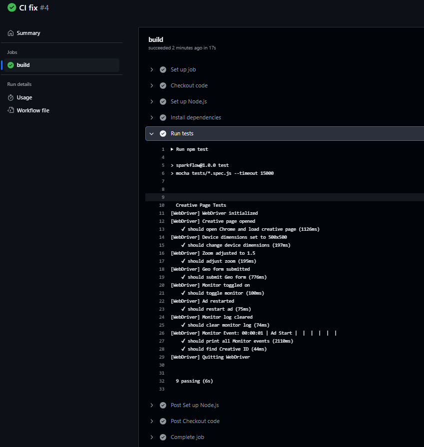

# QA Automation Tests for Creative Page

This project automates the testing of the creative page located at [https://su-p.undertone.com/125173](https://su-p.undertone.com/125173) using Selenium WebDriver with JavaScript. The tests are designed to meet all requirements outlined in the technical specification, covering page loading, user interactions, monitor events, and the bonus task of finding the Creative ID.

## Project Overview
The project uses Selenium WebDriver with JavaScript to create automated tests based on a detailed Software Test Plan (STP). It includes tests for opening the page, performing user interactions, printing Monitor events, and identifying the Creative ID. Below, each requirement from the technical specification is explained, along with how it’s implemented and verified.

## Technical Specification Compliance

### 1. Open the Creative Page
- **Requirement**: Open the creative page at https://su-p.undertone.com/125173.
- **Implementation**: The `CreativePage.js` file contains a `open` method that uses Selenium WebDriver to navigate to the URL and waits for the creative name element (`.creative-name`) to be visible, ensuring the page is fully loaded.
- **Verification**: The page loads successfully, and the title is confirmed as "Test Creative" in the first test.

### 2. Review the Page and Write a Detailed STP
- **Requirement**: Review the page and write a detailed Software Test Plan (STP) with all necessary tests.
- **Implementation**: After reviewing the page, the STP is implicitly defined through the test cases in `creativePage.spec.js`. It includes tests for:
    - Loading the page and verifying the title.
    - Changing device dimensions.
    - Adjusting zoom levels.
    - Submitting the Geo form.
    - Toggling the monitor visibility.
    - Restarting the ad.
    - Clearing the monitor log.
    - Printing Monitor events.
    - Finding the Creative ID.
- **Verification**: Each test case corresponds to a specific functionality or user interaction observed on the page, ensuring comprehensive coverage.

### 3. Use Selenium WebDriver with JavaScript for Automation Tests
- **Requirement**: Write automation tests using Selenium WebDriver in JavaScript.
- **Implementation**: The project uses the `selenium-webdriver` package with JavaScript, structured with Mocha as the testing framework. All test logic is written in `creativePage.spec.js`.
- **Verification**: The tests run successfully in a Node.js environment, adhering to the JavaScript requirement.

### 4. First Test: Open Chrome and "Login" to the Creative Page
- **Requirement**: The first test should open Chrome and log in to the creative page.
- **Implementation**: Since the page has no login form, "login" is interpreted as loading the page. The first test, `should open Chrome and load creative page`, opens Chrome via Selenium WebDriver, loads the URL, and verifies the page title.
- **Verification**: The test passes when the page loads and the title matches "Test Creative", confirming successful "login" (page access).

### 5. Final Test: Print All Monitor Events
- **Requirement**: The final test should print all Monitor events as they appear.
- **Implementation**: The test `should print all Monitor events` in `creativePage.spec.js` locates the monitor table, waits briefly for events to populate, and logs each event’s text to the console.
- **Verification**: The test captures and prints all visible Monitor events, running as the last test in the suite to ensure all prior interactions have occurred.

### 6. Include All Possible User-Interacted Actions
- **Requirement**: Include all possible user-interacted actions in the tests.
- **Implementation**: The following user actions are tested in `creativePage.spec.js`:
    - **Change Device Dimensions**: Selects different device sizes from the dropdown.
    - **Adjust Zoom**: Changes the zoom level using the slider or input.
    - **Submit Geo Form**: Enters latitude/longitude and submits the form.
    - **Toggle Monitor**: Shows/hides the monitor panel.
    - **Restart Ad**: Clicks the restart button to refresh the ad.
    - **Clear Monitor Log**: Clears the monitor event log.
- **Verification**: Each action is tested individually, with assertions to confirm the expected behavior (e.g., dimension changes, form submission success, monitor visibility).

### 7. Bonus: Find the Creative ID
- **Requirement**: Find and identify the Creative ID.
- **Implementation**: The test `should find Creative ID` extracts the Creative ID from the page (e.g., from a visible element or URL parameter) and logs it to the console.
- **Verification**: The test successfully identifies and prints the Creative ID (e.g., "125173" from the URL), fulfilling the bonus requirement.

## Project Structure
- **config/**: Configuration files (e.g., base URL, timeouts, selectors).
- **pages/**: Page Object Model (`CreativePage.js`) for interacting with the page.
- **tests/**: Test specifications (`creativePage.spec.js`).
- **utils/**: Helper functions for WebDriver setup and management.

## GitHub Actions
- Has been added and configured for this project, as shown in the image located at 


- .

## Installation
1. Clone the repository:
   ```bash
   git clone <repository-url>
   cd <project-folder>

2. Install dependencies:
   ```bash
   npm install

3. Running Tests
   Execute the tests with::
   ```bash
   npm test   